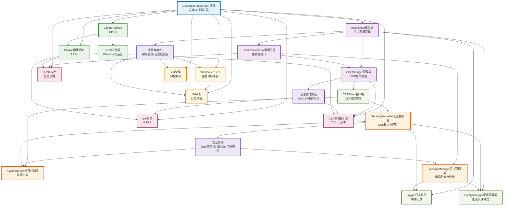

# DesktopTerminal-CEF 项目架构知识图谱

## 📋 文档概述

本文档详细描述了DesktopTerminal-CEF项目的完整架构知识图谱，包括核心组件、技术栈、安全策略、构建工具链以及组件间的关系。该知识图谱旨在为开发团队提供清晰的架构概览，指导开发决策和问题诊断。

## 🎯 项目概述

**DesktopTerminal-CEF** 是一个基于Qt5和CEF（Chromium Embedded Framework）的安全考试浏览器应用程序，专为教育考试环境设计。项目的核心特点包括：

- 🛡️ **安全性优先**: 提供严格的安全控制和全屏锁定功能
- 🔧 **最大兼容性**: 特别支持Windows 7 SP1 32位系统
- 🌐 **现代浏览器**: 使用CEF 75版本确保全平台兼容性
- 🖥️ **Kiosk模式**: 专为受控环境设计的全屏锁定应用

## 🏗️ 核心架构组件

### 1. 应用程序核心层

#### Application核心类
- **类型**: 核心组件
- **继承**: QApplication
- **职责**: 
  - 应用程序生命周期管理
  - 系统兼容性检测和评估
  - 架构检测（X86_32, X86_64, ARM64）
  - 平台识别（Windows, MacOS, Linux）
  - Windows 7 SP1特殊优化

#### SecureBrowser安全浏览器
- **类型**: 界面组件
- **继承**: QWidget
- **职责**:
  - 替代原项目ShellBrowser，集成CEF引擎
  - 全屏锁定和焦点强制控制
  - 安全退出热键管理（F10, Backslash）
  - 键盘过滤和上下文菜单禁用
  - 定时安全状态检查机制

#### CEFManager管理器
- **类型**: 核心组件
- **职责**:
  - CEF生命周期管理和配置
  - 进程模式选择（单进程/多进程）
  - 内存配置级别管理（Minimal, Balanced, Performance）
  - Windows 7和32位系统特殊参数配置
  - CEF浏览器实例创建和销毁

### 2. 安全控制层

#### SecurityController安全控制器
- **类型**: 安全组件
- **职责**:
  - URL访问控制和域名白名单/黑名单
  - 安全策略执行和违规检测
  - 严格安全模式和违规统计
  - 定时安全检查和事件信号发送

#### KeyboardFilter键盘过滤器
- **类型**: 安全组件
- **职责**:
  - 系统级键盘事件拦截
  - 危险按键组合阻止（Alt+Tab, Ctrl+Alt+Del等）
  - 平台特定键盘Hook实现
  - 键盘事件审计和日志记录

#### WindowManager窗口管理器
- **类型**: 界面组件
- **职责**:
  - 窗口全屏控制和焦点管理
  - 安全状态维护和定时监控
  - 多屏幕环境窗口管理
  - 窗口状态修复统计

### 3. 基础服务层

#### ConfigManager配置管理器
- **类型**: 配置组件
- **模式**: 单例
- **职责**:
  - JSON格式配置文件管理
  - 默认配置生成和验证
  - 应用设置、安全策略和CEF参数管理
  - 架构检测和兼容性配置

#### Logger日志系统
- **类型**: 工具组件
- **模式**: 单例
- **职责**:
  - 多级别日志管理（应用、安全、热键事件）
  - 文件输出和缓冲机制
  - 系统信息记录和启动过程跟踪
  - 密码输入和消息显示集成

#### CEFClient客户端实现
- **类型**: CEF组件
- **职责**:
  - CEF处理器接口实现
  - 显示、生命周期、加载、请求事件处理
  - JavaScript对话框禁用
  - 下载控制和URL验证
  - Windows 7和低内存模式优化

## 🔧 技术栈架构

### 核心框架

#### Qt5框架
- **版本**: 5.15.2
- **模块**: Core, Widgets
- **特性**: 
  - 跨平台C++GUI应用开发
  - CMake自动MOC、UIC、RCC处理
  - 为所有Qt组件提供基础支持

#### CEF浏览器引擎
- **版本**: 75.1.14
- **特性**:
  - Chromium Embedded Framework嵌入式浏览器
  - 支持Windows 7 SP1 32位系统
  - 单进程和多进程模式支持
  - 针对低内存环境优化

### 第三方库

#### QHotkey库
- **位置**: third_party/QHotkey
- **功能**: 跨平台全局热键管理
- **平台**: Windows/macOS/Linux
- **测试**: 包含HotkeyTest应用程序

### 构建工具链

#### CMake构建系统
- **版本要求**: 3.20+
- **标准**: C++17
- **特性**: 
  - 自动架构检测
  - CEF部署模块集成
  - 多平台编译配置

#### GitHub Actions
- **功能**: CI/CD自动化
- **支持平台**: Windows/Linux/macOS
- **特性**:
  - CEF缓存和验证机制
  - 跨平台安装包生成
  - 代码质量和安全检查

#### NSIS安装器
- **平台**: Windows专用
- **架构**: x86和x64
- **集成**: GitHub Actions构建流程

#### Visual Studio编译器
- **工具链**: MSVC v142
- **特性**: UTF-8编码，Windows 7兼容性

## 🎯 目标平台架构

### 主要目标平台

#### Windows 7 SP1
- **优先级**: 主要目标平台
- **优化**: 特别针对32位系统
- **配置**: DirectX和硬件加速特殊设置
- **CEF模式**: 单进程模式和低内存优化

### 系统架构支持

#### x86架构（32位）
- **优先级**: 主要目标架构
- **限制**: 内存限制，需要特殊优化
- **CEF配置**: 单进程模式，禁用GPU加速
- **特性**: 禁用高级功能以确保稳定性

#### x64架构（64位）
- **优先级**: 兼容支持
- **优势**: 更大内存空间，更高性能
- **CEF配置**: 多进程模式支持
- **特性**: 支持全部高级功能

## 🛡️ 安全策略实现

### 安全控制功能

#### URL访问控制
- 域名白名单和黑名单机制
- URL模式匹配和验证
- 外部链接安全检查

#### 键盘事件控制
- 危险按键组合拦截
- 系统级键盘Hook实现
- 键盘事件审计记录

#### 窗口安全控制
- 全屏锁定强制执行
- 焦点管理和窗口置顶
- 定时状态检查和修复

#### 安全退出机制
- 密码验证安全退出
- 热键组合（F10, Backslash）
- 违规行为检测和响应

### 违规检测类型
- 未授权URL访问
- 禁止的键盘操作
- 窗口状态操纵
- 进程违规行为

## 🔄 系统集成特性

### 兼容性检测

#### 系统信息检测
- 自动架构识别（x86/x64/ARM64）
- 平台类型判断（Windows/macOS/Linux）
- 兼容性级别评估（传统/现代/最优）

#### 自适应配置
- 根据系统能力选择CEF参数
- Windows 7特殊优化模式
- 32位系统低内存配置

### 消息循环集成

#### Qt-CEF协调
- Qt主消息循环与CEF消息循环集成
- 跨线程事件同步处理
- 浏览器生命周期事件管理
- UI渲染和CEF渲染时间调度

## 📊 项目架构可视化

## 🔗 组件关系说明

### 依赖关系
- **包含关系**: 项目包含核心组件和第三方库
- **继承关系**: 所有Qt组件继承自Qt5框架基类
- **使用关系**: 组件间的功能调用和服务依赖
- **管理关系**: 上层组件对下层组件的生命周期管理

### 数据流向
1. **配置流**: ConfigManager → 各组件配置读取
2. **事件流**: UI事件 → 安全检查 → CEF处理
3. **日志流**: 各组件 → Logger → 文件输出
4. **消息流**: Qt消息循环 ↔ CEF消息循环

### 安全控制流
1. **URL请求**: CEFClient → SecurityController → 白名单验证
2. **键盘事件**: 系统 → KeyboardFilter → 危险按键拦截
3. **窗口状态**: WindowManager → 定时检查 → 强制修复
4. **违规处理**: 检测 → SecurityController → 日志记录

## 📈 知识图谱统计

### 实体统计
- **总实体数**: 24个
- **核心组件**: 10个
- **技术栈**: 7个
- **目标平台**: 3个
- **功能模块**: 4个

### 关系统计
- **总关系数**: 49个
- **依赖关系**: 15个
- **继承关系**: 8个
- **管理关系**: 6个
- **其他关系**: 20个

## 🎯 架构优势分析

### 1. 模块化设计
- 清晰的组件边界和职责分离
- 松耦合的组件间通信机制
- 易于测试和维护的架构结构

### 2. 安全性保障
- 多层次安全控制机制
- 全面的事件拦截和过滤
- 完善的审计和日志记录

### 3. 兼容性优化
- 自动化系统检测和适配
- 针对性的平台优化策略
- 渐进式功能降级机制

### 4. 可扩展性
- 插件化的安全策略设计
- 可配置的组件参数
- 模块化的功能扩展点

## 🔧 维护指南

### 添加新功能
1. 确定功能归属的架构层级
2. 评估对现有组件的影响
3. 更新相关配置和日志记录
4. 验证安全策略的兼容性

### 问题诊断
1. 查看知识图谱确定相关组件
2. 检查组件间的依赖关系
3. 分析日志记录和事件流向
4. 定位问题根因和影响范围

### 性能优化
1. 识别性能瓶颈组件
2. 分析组件间的数据流量
3. 优化关键路径的处理逻辑
4. 平衡功能性和性能需求

## 📚 相关文档

- [项目README](../README.md) - 项目概述和快速开始
- [构建指南](../docs/build-guide.md) - 详细构建说明
- [安全策略](../docs/security-policy.md) - 安全功能详解
- [配置文档](../docs/configuration.md) - 配置选项说明
- [开发指南](../docs/development-guide.md) - 开发规范和最佳实践

---

**文档版本**: 1.0  
**最后更新**: 2025年1月  
**维护者**: DesktopTerminal-CEF开发团队

> 本知识图谱将随着项目的发展持续更新和完善。如有任何问题或建议，请通过项目Issue进行反馈。 